# Wireframes

Reference the Creating an Entity Relationship Diagram final project guide in the course portal for more information about how to complete this deliverable.

---

## List of Pages

- Login ⭐  
- Feed ⭐  
- Company Page ⭐  
- Profile Page ⭐  
- Submit Entry Page ⭐  
- News Page ⭐  

---

# Low-Fidelity Wireframes

## Wireframe 1: Login / Signup Page  
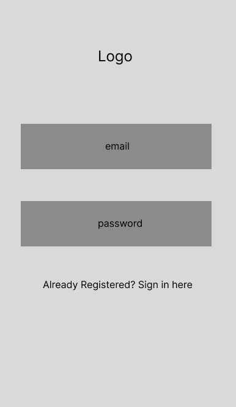  
Login and signup page.

---

## Wireframe 2: Profile Page (/profile)  
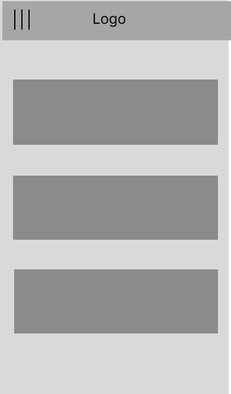  
My Profile page — where users can view and delete the stories they posted.

---

## Wireframe 3: Entry Detail Modal  
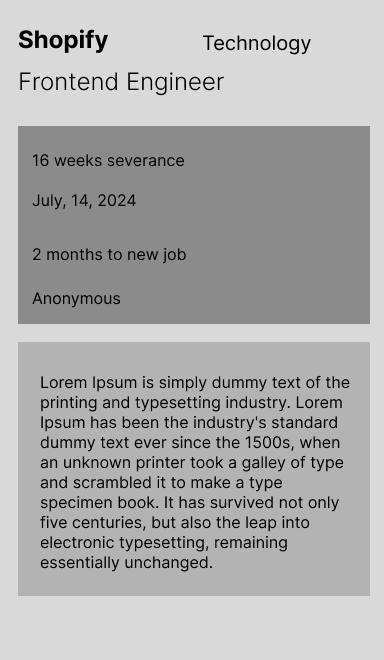  
Popup modal that opens when a story is clicked.

---

## Wireframe 4: Feed Page (/feed)  
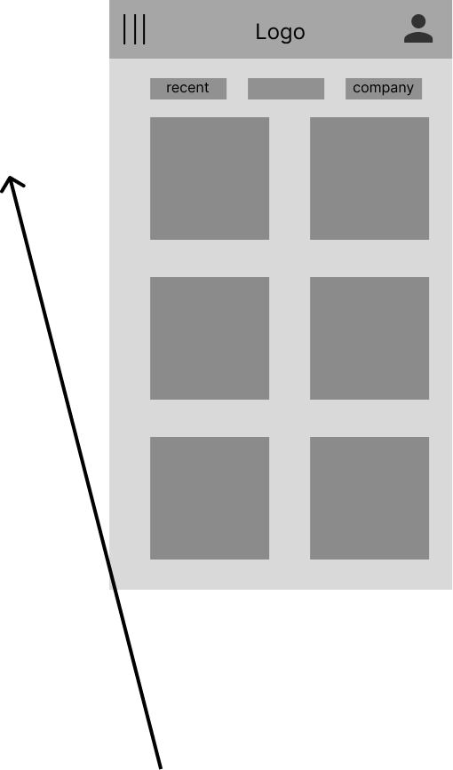  
Main feed page where users scroll through all layoff stories.

---

## Wireframe 5  
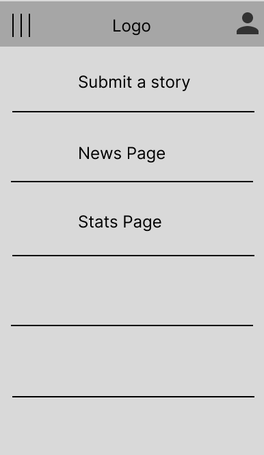

---

## Wireframe 6: Submit Entry Page (/submit)  
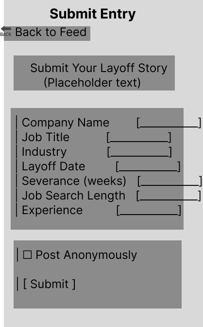  
Form for users to write and post their layoff story.

---

## Wireframe 7: Company Page (/company/:id)  
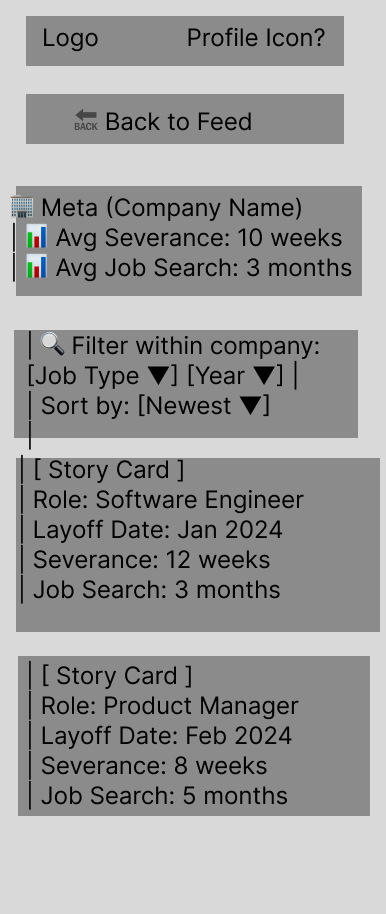  
Page showing stories and stats for a specific company.

---

## Wireframe 8: News Page (/news)  
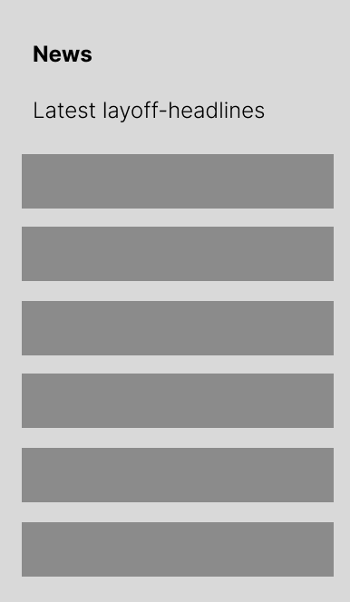  
Page showing latest layoff news from the internet.

---

# High-Fidelity Mockups

## Wireframe 1: Login / Signup Page  
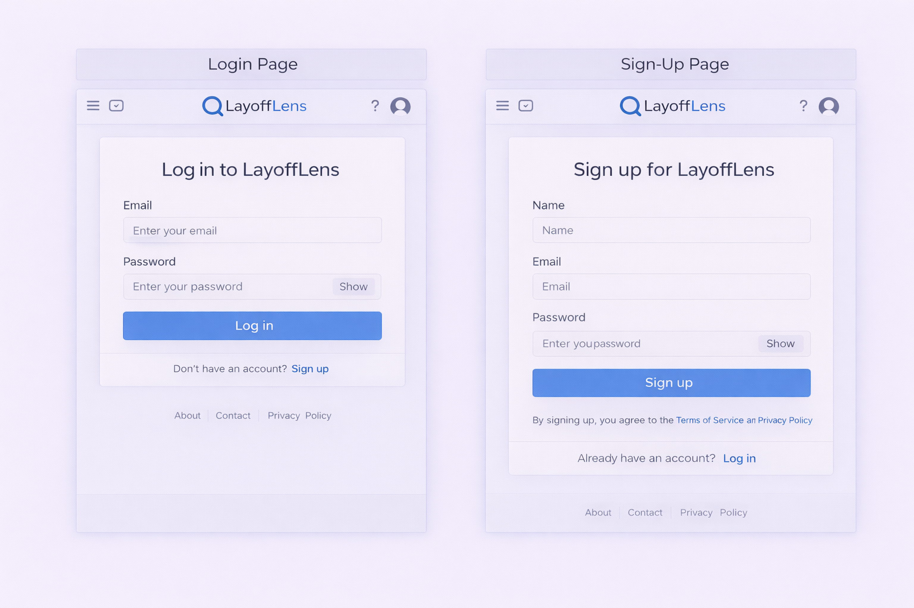

---

## Wireframe 2: Feed Page  
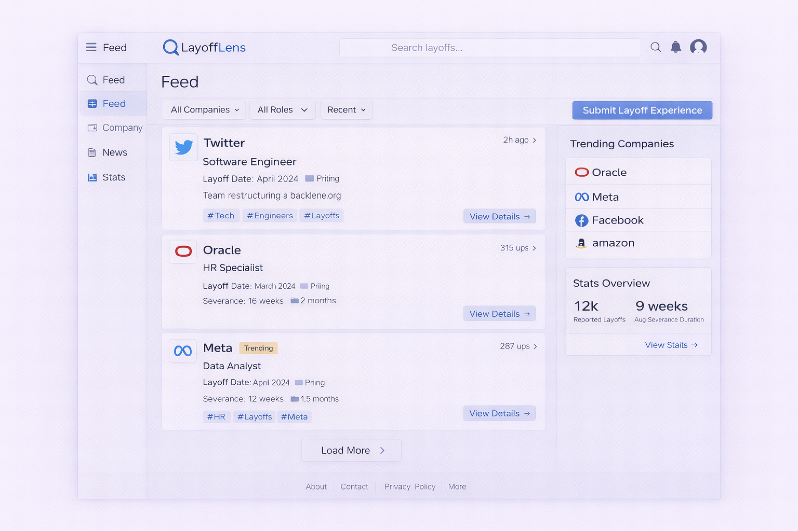

---

## Wireframe 3: Submit Entry Page (Step-by-step flow)  
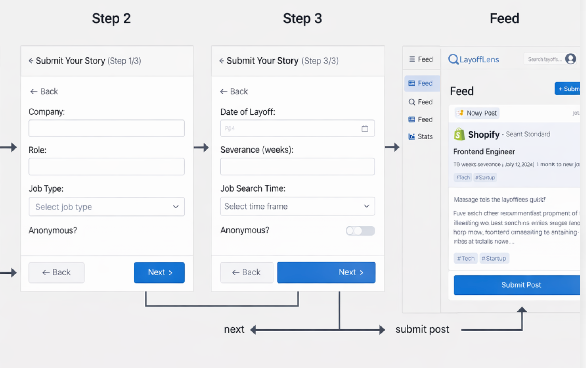

---

## Wireframe 4: Profile Page  
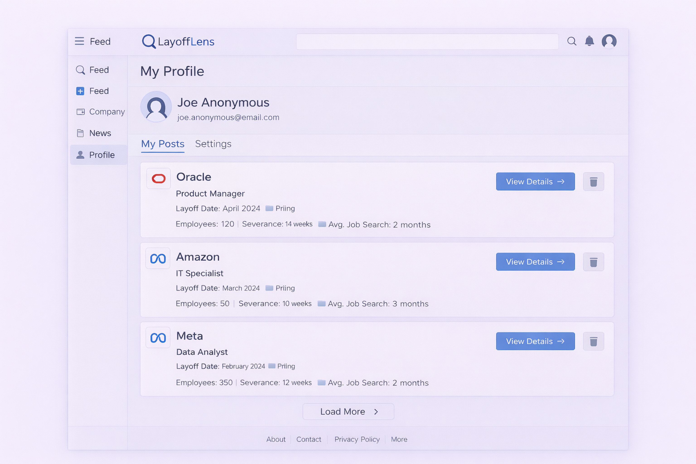

---

## Wireframe 5: Company Page  
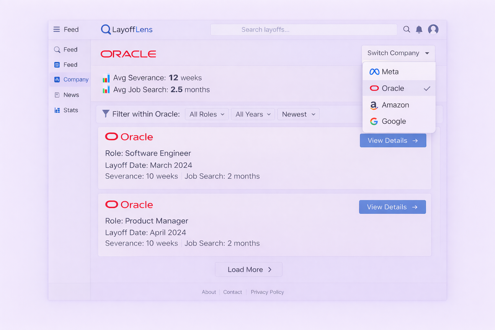

---

## Wireframe 6: News Page  
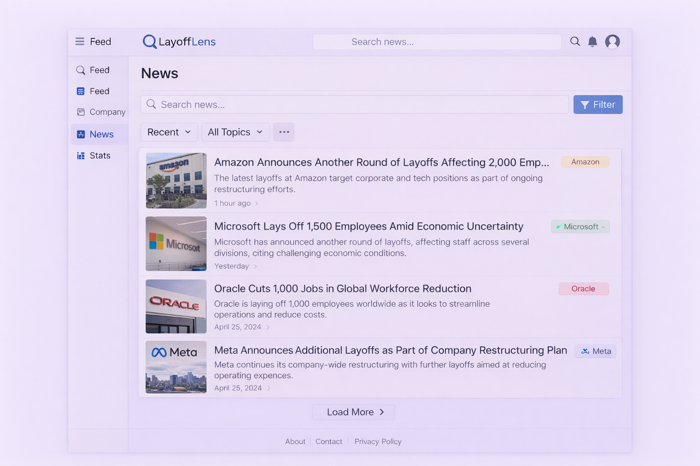

---

## Wireframe 7: Entry Detail Modal  
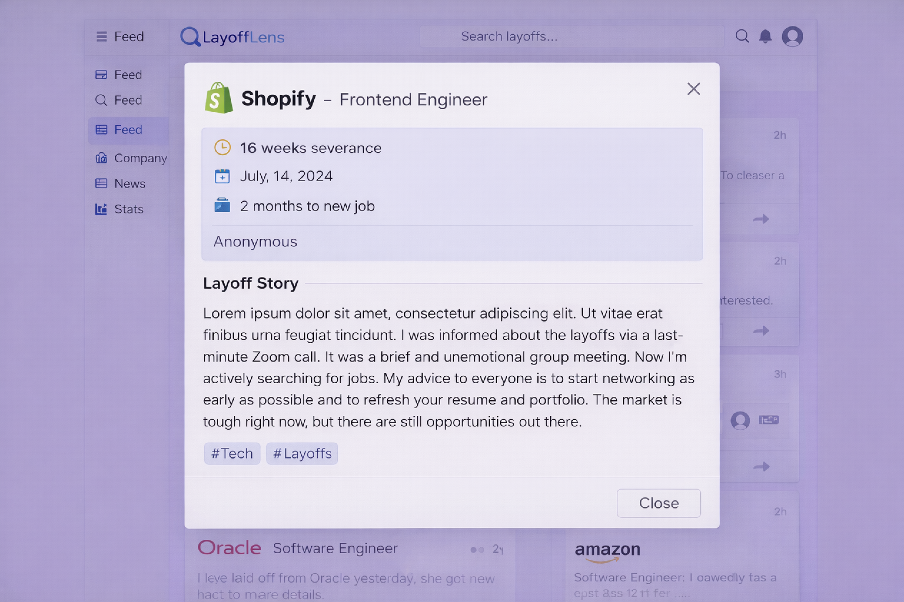